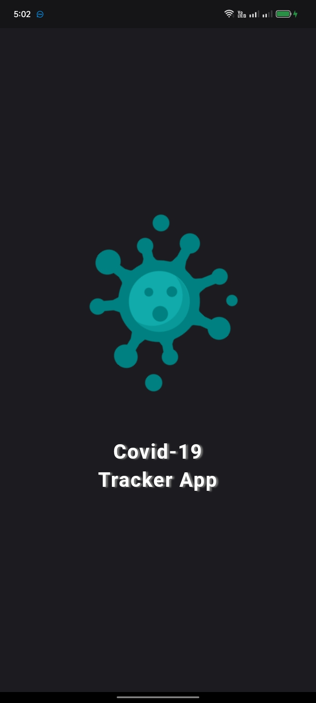
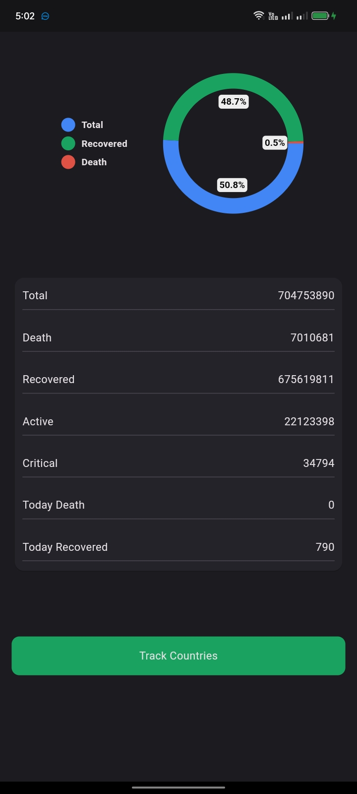
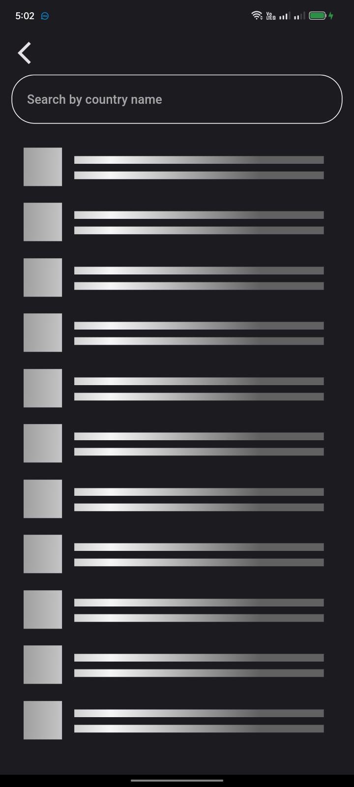
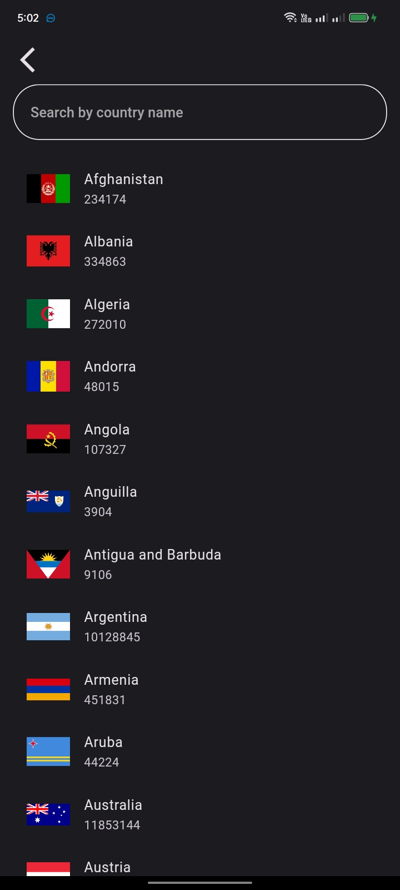
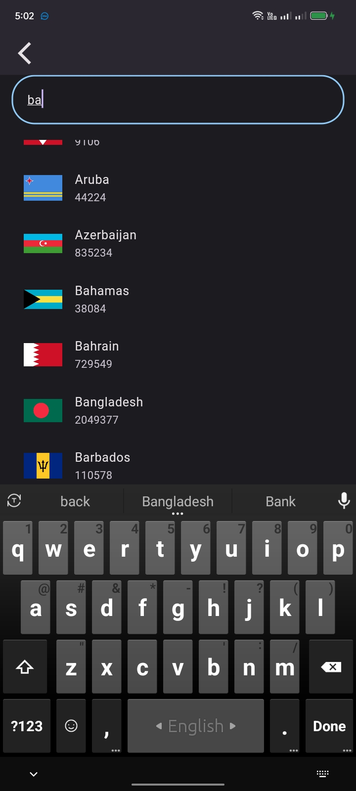
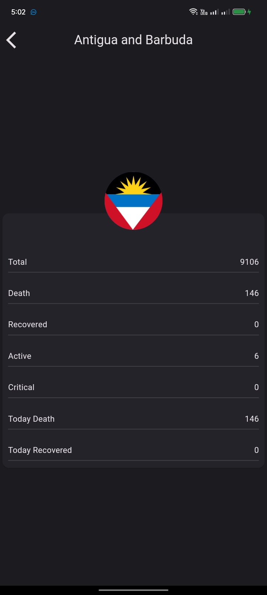

# Covid Tracker Apps Based on API

## This are the all screen of this app

<h3>Loading Screen</h3>

<h3>Home Screen</h3>

<h3>Shimmer effect</h3>

<h3>Search Screen</h3>

<h3>Short Search by name</h3>

<h3>Detail Screen</h3>

